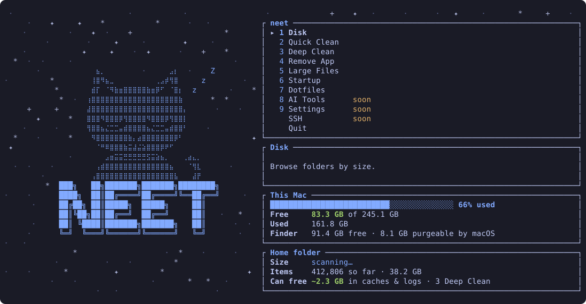

<h1 align="center">neet</h1>

<p align="center">macOS terminal for cleaning, optimizing and managing your mac</p>

<p align="center">
  <a href="https://github.com/ado11231/neet/actions/workflows/ci.yml"></a>
  
  
  <a href="#license"></a>
</p>

<p align="center">
  
</p>

## Install

The install script downloads a ready made program for your Mac, Apple silicon or Intel, and puts it in `~/.cargo/bin`:

```sh
curl --proto '=https' --tlsv1.2 -LsSf https://github.com/ado11231/neet/releases/latest/download/neet-installer.sh | sh
```

If you have [Rust](https://rustup.rs), you can build the published version instead:

```sh
cargo install neet
```

Or build the newest code from source:

```sh
cargo install --git https://github.com/ado11231/neet neet
```

## Use

```sh
neet
```

* neet opens on a menu and starts scanning your home folder in the background.
* Use the arrow keys to move, `Enter` to open a screen, `Esc` to go back, `?` for help, and `q` to quit.

| Screen | What It Does |
| --- | --- |
| Disk | Browse your folders, largest first. |
| Clean | Move caches and other files your apps can make again to the Trash. |
| Large Files | Find your largest and oldest files. |
| Remove App | Remove an app along with the files it left in your Library folder. |

## Notes

* Works on macOS 13 or later, on Apple silicon and Intel.
* Files go to the Trash, never deleted, so you can put them back.
* You review and confirm everything before it moves.
* Your personal folders, iCloud files, keychains, and SSH keys are never touched.
* For a full scan, give your terminal Full Disk Access:
  1. Open System Settings, then Privacy & Security, then Full Disk Access.
  2. Turn on your terminal app, such as Terminal, iTerm, or Ghostty.
  3. Quit and reopen the terminal, then run `neet` again.

## Learn More

* [Features](docs/FEATURES.md): what neet does now, and what is planned.
* [Interface](docs/INTERFACE.md): every screen, its layout, and its keys.
* [Safety](docs/SAFETY.md): what neet may and may not change.
* [Roadmap](docs/ROADMAP.md): what is done and what comes next.

## License

Licensed under either [MIT](LICENSE-MIT) or [Apache 2.0](LICENSE-APACHE), at your choice.
